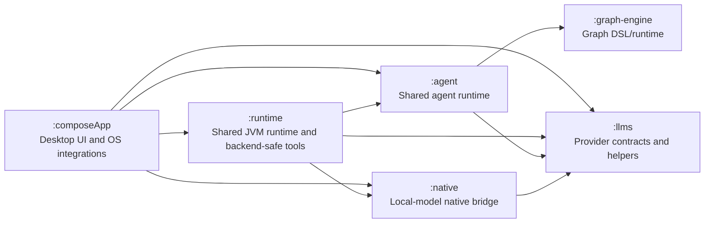
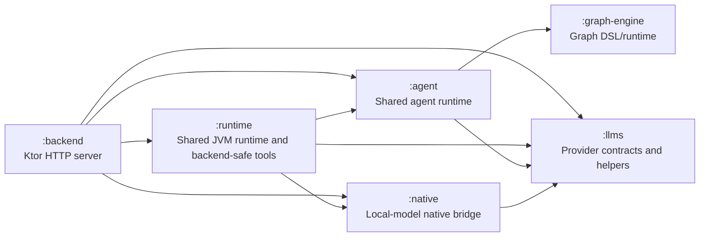
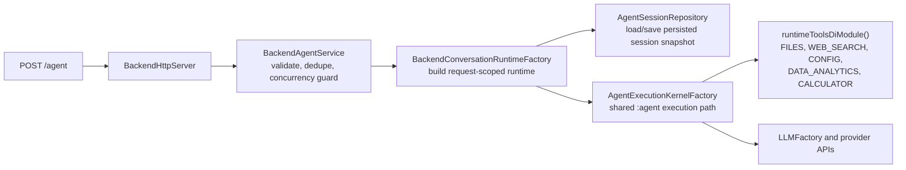

# Souz

Souz is a Kotlin Multiplatform desktop AI assistant built with Compose for Desktop.

## Note for LLM

Keep this file updated whenever top level details changes.
If you are not sure about something, left a note for other developers to review.

### UI architecture principles

- UI layers (Screens and Composables) should not do neither business logic, nor IO operations.
- UI-logic should be coordinated from ViewModels. ViewModel may delegate business logic to UseCases.

### Development principles

- Prefer composition to inheritance.
- Do not mix coroutines with the JVM low level concurrency primitives such as: Volatile, Synchronize, ThreadLocal, etc).
- Utilize open closed principle.

## Features

- **Graph-based agent runtime** with explicit nodes, transitions, retries, and session history.
- **Multi-model LLM integrations** for GigaChat (REST/voice), Qwen, AiTunnel, Anthropic Claude, and OpenAI APIs.
- **Local llama.cpp provider** with a thin native bridge, strict JSON tool contract, a RAM-gated local model catalog (Qwen plus Gemma 4 chat profiles), linked local EmbeddingGemma GGUF downloads/usage for embeddings, background preload/warmup on local chat model selection, prompt-family-aware rendering (Qwen ChatML and Gemma 4 turns), prompt-prefix/KV reuse inside the native runtime, settings-driven context windows for local inference within model caps, and model storage under `~/.local/state/souz/models/`.
- **Shared JVM runtime layer** in `:runtime` for provider clients, config/settings access, file utilities, and backend-safe tool categories (`FILES`, `WEB_SEARCH`, `CONFIG`, `DATA_ANALYTICS`, `CALCULATOR`) reused by both desktop and backend agent execution.
- **HTTP backend agent runtime** in `:backend` exposed via `POST /agent`, with request-scoped agent execution per `userId` + `conversationId`, persisted in-memory conversation snapshots across turns, and per-request model/context/locale/time-zone overrides.
- **Key-aware model selection in Settings**: chat, embeddings, and voice recognition model lists are filtered by configured provider keys; invalid saved selections are normalized to available providers.
- **MCP integration** over `stdio` and `http` with OAuth discovery and token refresh support.
- **Rich desktop toolset** in `:composeApp` on top of the shared runtime tools: browser, calendar, mail, notes, desktop automation, Telegram, presentations, app launch, and text/clipboard actions.
- **Two-mode internet search**: quick-answer web lookup for simple factual questions and multi-step research mode with LLM-built strategy, broader source coverage, cited long-form synthesis, and automatic `.md` export for oversized reports.
- **Voice and desktop interaction** via audio recording/playback, global hotkeys, and native media key bindings.

## Project Structure

```text
.
├── docs/                                   # Project docs extracted from top-level notes
├── agent/                                  # Shared agent runtime module
├── graph-engine/                           # Shared graph DSL/runtime module
├── llms/                                   # Shared LLM contracts/helpers module
├── native/                                 # Shared local-model runtime/native bridge module
├── runtime/                                # Shared JVM runtime and backend-safe tools
│   ├── src/main/kotlin/ru/souz/db/         # Config store + settings provider
│   ├── src/main/kotlin/ru/souz/llms/       # Provider APIs and runtime LLM helpers
│   ├── src/main/kotlin/ru/souz/service/    # Shared JVM services (currently file services)
│   └── src/main/kotlin/ru/souz/tool/       # Shared tool catalog, file/web/config/data/math tools
├── backend/                                # JVM HTTP backend with shared agent runtime reuse
│   ├── src/main/kotlin/ru/souz/backend/    # app/http/agent/common layered backend packages
│   ├── src/test/kotlin/ru/souz/backend/    # Backend service/runtime tests
│   └── AGENTS.md                           # Module notes and REST contract
├── composeApp/                             # Desktop application and OS-bound integrations
│   ├── src/jvmMain/kotlin/ru/souz/di/      # Desktop DI wiring and agent host setup
│   ├── src/jvmMain/kotlin/ru/souz/service/ # Audio, MCP, permissions, Telegram, telemetry, image, keys
│   ├── src/jvmMain/kotlin/ru/souz/tool/    # Desktop-only tools (browser, calendar, mail, notes, etc.)
│   ├── src/jvmMain/kotlin/ru/souz/ui/      # Compose screens, view models, and tool/settings UI
│   └── src/jvmTest/                        # JVM test source set
├── dest/                                   # Local output/scratch directory
├── build-logic/                            # Included Gradle build with convention plugins/shared build logic
└── gradle/                                 # Gradle version catalog and wrapper configuration
```

## Module Graphs

### KMP/Desktop



### Backend



- `:runtime` owns the shared JVM wiring plus the reusable tool catalog that backend can execute without desktop integrations.
- `:composeApp` layers desktop-only services and tools on top of the shared runtime modules.
- `:backend` imports `runtimeToolsDiModule(includeWebImageSearch = false)` and exposes the shared agent runtime over HTTP without the image-search tool that would otherwise initialize Tika's external parser probes on startup.

## Backend `/agent` Flow



- Backend host adapters intentionally replace desktop-only SPI pieces with no-op implementations while keeping the same graph execution kernel.
- Conversation state is loaded and saved by `userId` + `conversationId` on each request, while each turn can override model alias, context window, locale, and time zone.

## Builds

- Desktop KMP app: `./gradlew :composeApp:jvmRun` or the existing Compose distribution tasks.
- Backend JVM app: `./gradlew :backend:run`. It binds to `127.0.0.1:8080` by default, configurable with `SOUZ_BACKEND_HOST` and `SOUZ_BACKEND_PORT`.
