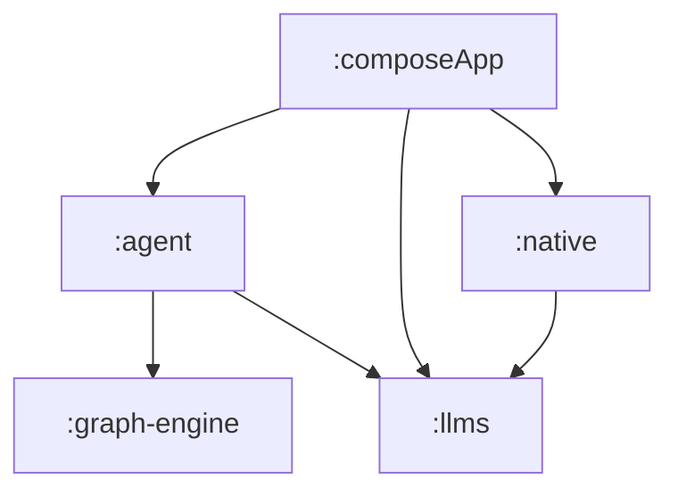

# Souz

[Website](https://souz.app)

A desktop AI agent focused on security. The principles are described in:

- [How to Build AI Agents You Can Actually Trust](https://medium.com/@liverm0r/building-ai-agents-for-non-technical-users-50d24c3184a8)
- [The same article in Russian](https://habr.com/ru/articles/1010236/)

# Installation

```bash
brew tap D00mch/tap
brew install --cask souz-ai
```

Or get it directly from the latest [release](https://github.com/D00mch/souz/releases).

# Developer notes
 
Take a look at the [contributing page](docs/CONTRIBUTING.md).

Recommended IntelliJ IDEA plugins:

- Kotlin Multiplatform;
- Compose Multiplatform;
- Compose Multiplatform (optional for additional Desktop IDE support);

To launch preview rendering, press the desktop preview button near the composable.
       
Run tests with:
```bash
./gradlew :composeApp:cleanJvmTest :composeApp:jvmTest
```

Run integration tests with:
```bash
export SOUZ_AGENT_INTEGRATION_TESTS_ON=true && ./gradlew :composeApp:cleanJvmTest :composeApp:jvmTest --tests "agent.GraphAgentComplexScenarios"
```

## Module Structure



# Compose builds

## Release builds

- [KMP release documentation](https://github.com/JetBrains/compose-multiplatform/blob/master/tutorials/Signing_and_notarization_on_macOS/README.md).
- Use [kmp-build-macos-universal.sh](build-logic/kmp-build-macos-universal.sh) script to prepare app bundles.
- Use [kmp-build-macos-dev.sh](build-logic/kmp-build-macos-dev.sh) to build notarized arch-specific DMGs and export each one to `dest/homebrew/<version>/`.
- Use [prepare-homebrew-release.sh](build-logic/prepare-homebrew-release.sh) to generate the `souz-ai` tap cask from the DMGs in `dest/homebrew/<version>/`.
