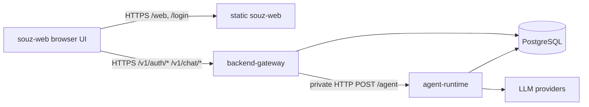

# Cloud Multiuser Agent Specification

Status: draft for implementation.

This document fixes the first cloud contract for Souz web multiuser mode. It uses the existing `souz-backend`
PostgreSQL/Flyway stack as the base database layer and keeps the agent runtime as a separate server process.

## Goals

- Run the Souz agent engine on a server and expose it through an internal `POST /agent` endpoint.
- Support multiple users by loading and storing conversation history by authenticated `userId`.
- Add a public backend gateway responsible for browser authentication, redirects, cookies, and forwarding chat requests to the agent runtime.
- Add a simple web experience in `souz-web`: landing button, login page with cookie consent, and minimal chat page with model and context size controls.
- Store user login, password hash, sessions, and chat history in the same PostgreSQL database already used by `souz-backend`.

## Non-goals For MVP

- Public user registration and billing.
- Sharing conversations between users.
- Desktop-only tools in the cloud web agent. Cloud mode must start with a server-safe tool catalog.
- File attachments, voice input, streaming, and tool approval UI. These can be added after the base contract is stable.
- Direct browser access to `/agent`.

## Existing Context

- Main app: `/Users/duxx/IdeaProjects/abledo`.
- Agent entry point today: `AgentFacade.execute(input: String)`.
- Agent context today: `AgentContext(input, settings, history, activeTools, systemPrompt)`.
- LLM message model today: `LLMRequest.Message(role, content, functionsStateId, attachments, name)`.
- Current default context size: `DEFAULT_MAX_TOKENS = 16000`.
- Existing backend: `/Users/duxx/IdeaProjects/souz-backend`.
- Existing backend stack: Kotlin 2.2, Ktor, PostgreSQL, JDBC + HikariCP, Flyway-style SQL migrations.
- Current `DatabaseFactory.migrate` manually executes `V1__init.sql`; cloud implementation must switch to real Flyway execution or explicitly execute all ordered migration files, including the new `V2`.
- Existing database service is PostgreSQL from `souz-backend/compose.yaml`.
- Existing public backend error shape is:

```json
{
  "message": "Human readable error"
}
```

## High Level Architecture



## Service Boundaries

### `souz-web`

Frontend React/Vite app.

Responsibilities:

- Add a button on the landing page that opens the web app, for example `/web`.
- Route unauthenticated users to `/login?redirect=/web/chat`.
- Show cookie storage consent on the login page before login submission.
- Store no auth token in `localStorage`.
- Use cookie-based authentication through the gateway.
- Render the MVP chat page:
  - model selector;
  - context size selector/input;
  - message list;
  - prompt input;
  - send button;
  - logout button.

### `backend-gateway`

Public backend. Can be implemented inside the existing `souz-backend` codebase as a new logical area, but must be a separate public boundary from the agent runtime.

Responsibilities:

- Authenticate users by login and password.
- Set and refresh browser auth cookies.
- Validate session cookies on every protected request.
- Derive `userId` from the authenticated session.
- Never trust `userId` from browser request bodies.
- Redirect browser page requests without a valid session to `/login`.
- Return JSON `401` for unauthenticated API requests.
- Proxy authenticated chat requests to internal `agent-runtime`.
- Expose models metadata to the web UI.

### `agent-runtime`

Internal backend. Not exposed on the public internet.

Responsibilities:

- Accept internal `POST /agent` requests from the gateway only.
- Validate service-to-service authentication.
- Load conversation history from PostgreSQL by `userId` and `conversationId`.
- Build a request-scoped agent context.
- Execute the agent graph with selected model and context size.
- Persist user and assistant messages.
- Return the assistant response and canonical message ids.

Important implementation rule: cloud runtime must not use a single shared mutable `AgentFacade.currentContext` across users. The runtime must either instantiate request-scoped agent dependencies or introduce a stateless `AgentRuntimeService.run(request)` that receives explicit history/settings and returns updated history/output.

## Trust Model

- Browser is untrusted.
- Gateway is the public trust boundary.
- Agent runtime is internal only and trusts requests only after gateway service authentication.
- PostgreSQL is private and not exposed publicly.
- Public chat API does not accept `userId`.
- Internal `/agent` does accept `userId`, but only because it is private and authenticated service-to-service.

## Database Contract

Use the existing `souz-backend` PostgreSQL database and add a new migration, for example `V2__cloud_auth_chat.sql`.
Do not rewrite the existing telemetry tables.

Migration runner requirement:

- The current backend code must be updated before adding `V2`, because it loads only `db/migration/V1__init.sql`.
- Preferred implementation: use Flyway from the existing dependencies and run all `db/migration/V*__*.sql` files.
- Temporary acceptable implementation: keep the manual runner but execute every ordered migration file exactly once with an internal schema history table.

Recommended extension:

```sql
CREATE TABLE IF NOT EXISTS app_users (
    user_id UUID PRIMARY KEY,
    login TEXT NOT NULL UNIQUE,
    password_hash TEXT NOT NULL,
    display_name TEXT,
    role TEXT NOT NULL DEFAULT 'user',
    created_at TIMESTAMPTZ NOT NULL DEFAULT NOW(),
    updated_at TIMESTAMPTZ NOT NULL DEFAULT NOW(),
    disabled_at TIMESTAMPTZ
);

CREATE TABLE IF NOT EXISTS auth_sessions (
    session_id UUID PRIMARY KEY,
    user_id UUID NOT NULL REFERENCES app_users(user_id) ON DELETE CASCADE,
    refresh_token_hash TEXT NOT NULL UNIQUE,
    user_agent TEXT,
    request_ip TEXT,
    created_at TIMESTAMPTZ NOT NULL DEFAULT NOW(),
    last_seen_at TIMESTAMPTZ NOT NULL DEFAULT NOW(),
    expires_at TIMESTAMPTZ NOT NULL,
    revoked_at TIMESTAMPTZ
);

CREATE INDEX IF NOT EXISTS idx_auth_sessions_user_id ON auth_sessions(user_id);
CREATE INDEX IF NOT EXISTS idx_auth_sessions_expires_at ON auth_sessions(expires_at);

CREATE TABLE IF NOT EXISTS chat_conversations (
    conversation_id UUID PRIMARY KEY,
    user_id UUID NOT NULL REFERENCES app_users(user_id) ON DELETE CASCADE,
    title TEXT,
    is_default BOOLEAN NOT NULL DEFAULT FALSE,
    created_at TIMESTAMPTZ NOT NULL DEFAULT NOW(),
    updated_at TIMESTAMPTZ NOT NULL DEFAULT NOW(),
    archived_at TIMESTAMPTZ
);

CREATE UNIQUE INDEX IF NOT EXISTS idx_chat_conversations_default
    ON chat_conversations(user_id)
    WHERE is_default = TRUE AND archived_at IS NULL;

CREATE INDEX IF NOT EXISTS idx_chat_conversations_user_id
    ON chat_conversations(user_id, updated_at DESC);

CREATE TABLE IF NOT EXISTS chat_messages (
    message_id UUID PRIMARY KEY,
    conversation_id UUID NOT NULL REFERENCES chat_conversations(conversation_id) ON DELETE CASCADE,
    user_id UUID NOT NULL REFERENCES app_users(user_id) ON DELETE CASCADE,
    seq INTEGER NOT NULL,
    role TEXT NOT NULL CHECK (role IN ('system', 'user', 'assistant', 'function')),
    content TEXT NOT NULL,
    model TEXT,
    provider TEXT,
    context_size INTEGER,
    request_id UUID,
    functions_state_id TEXT,
    token_usage JSONB,
    metadata JSONB NOT NULL DEFAULT '{}'::jsonb,
    created_at TIMESTAMPTZ NOT NULL DEFAULT NOW(),
    UNIQUE (conversation_id, seq)
);

CREATE INDEX IF NOT EXISTS idx_chat_messages_conversation_seq
    ON chat_messages(conversation_id, seq);
CREATE INDEX IF NOT EXISTS idx_chat_messages_user_created
    ON chat_messages(user_id, created_at DESC);
CREATE INDEX IF NOT EXISTS idx_chat_messages_metadata
    ON chat_messages USING GIN(metadata);

CREATE TABLE IF NOT EXISTS agent_requests (
    request_id UUID PRIMARY KEY,
    user_id UUID NOT NULL REFERENCES app_users(user_id) ON DELETE CASCADE,
    conversation_id UUID NOT NULL REFERENCES chat_conversations(conversation_id) ON DELETE CASCADE,
    prompt_message_id UUID REFERENCES chat_messages(message_id),
    response_message_id UUID REFERENCES chat_messages(message_id),
    model TEXT NOT NULL,
    provider TEXT,
    context_size INTEGER NOT NULL,
    status TEXT NOT NULL CHECK (status IN ('accepted', 'running', 'succeeded', 'failed', 'cancelled')),
    error_message TEXT,
    created_at TIMESTAMPTZ NOT NULL DEFAULT NOW(),
    started_at TIMESTAMPTZ,
    finished_at TIMESTAMPTZ
);

CREATE INDEX IF NOT EXISTS idx_agent_requests_user_created
    ON agent_requests(user_id, created_at DESC);
CREATE INDEX IF NOT EXISTS idx_agent_requests_conversation_created
    ON agent_requests(conversation_id, created_at DESC);
```

### Password Storage

- Store only password hashes, never plaintext passwords.
- Preferred hash: Argon2id encoded string with salt and parameters embedded.
- If Argon2id is not available in the first backend iteration, bcrypt is acceptable, but the column remains `password_hash`.
- Login comparison must use normalized login (`trim`, case policy fixed by product; recommended lowercase for email-like logins).

### Chat Message Ordering

Message append must run in a transaction:

1. Lock the conversation row with `SELECT ... FOR UPDATE`.
2. Read current max `seq`.
3. Insert next message rows with incremented `seq`.
4. Update `chat_conversations.updated_at`.

This avoids message ordering races when two requests hit the same conversation.

## Authentication Contract

Use cookie-based browser auth.

Cookies:

- `souz_access_token`: HttpOnly, Secure, SameSite=Lax, short TTL, contains signed access JWT.
- `souz_refresh_token`: HttpOnly, Secure, SameSite=Lax, longer TTL, opaque random token whose hash is stored in `auth_sessions`.
- `souz_csrf`: readable random token for double-submit CSRF protection on state-changing API calls.
- `souz_cookie_consent`: readable non-auth cookie set after the user accepts cookie storage on the login page.

Access JWT claims:

```json
{
  "sub": "user-uuid",
  "sid": "session-uuid",
  "login": "user@example.com",
  "role": "user",
  "iat": 1772312312,
  "exp": 1772313212
}
```

CSRF rule:

- All mutating browser API requests (`POST`, `PUT`, `PATCH`, `DELETE`) must send `X-CSRF-Token`.
- Gateway accepts the request only when `X-CSRF-Token` equals the readable `souz_csrf` cookie and the auth session is valid.

## Public Gateway API

Base URL examples use `/v1`. All responses use `Content-Type: application/json`.

### `POST /v1/auth/login`

Authenticates by login/password and sets auth cookies.

Request:

```json
{
  "login": "user@example.com",
  "password": "plain password from form"
}
```

Success `200`:

```json
{
  "user": {
    "userId": "9d243496-4c5e-4f53-a55e-4fe65092613e",
    "login": "user@example.com",
    "displayName": "Artur",
    "role": "user"
  },
  "expiresAt": "2026-04-29T15:30:00Z"
}
```

Errors:

- `400` invalid JSON or blank fields.
- `401` invalid login/password. Do not reveal which field was wrong.
- `403` disabled user.
- `429` too many login attempts.

### `POST /v1/auth/refresh`

Rotates refresh token and sets new auth cookies.

Request body: empty JSON object.

Success `200` returns the same shape as login.

Errors:

- `401` missing, expired, revoked, or unknown refresh token.

### `POST /v1/auth/logout`

Revokes the current refresh session and clears auth cookies.

Request body: empty JSON object.

Success `204`: empty body.

### `GET /v1/auth/session`

Returns the current authenticated user.

Success `200`:

```json
{
  "user": {
    "userId": "9d243496-4c5e-4f53-a55e-4fe65092613e",
    "login": "user@example.com",
    "displayName": "Artur",
    "role": "user"
  },
  "expiresAt": "2026-04-29T15:30:00Z"
}
```

Error:

- `401` no valid session.

### `GET /v1/models`

Returns server-enabled chat models.

Success `200`:

```json
{
  "models": [
    {
      "alias": "GigaChat-Max",
      "displayName": "GigaChat Max",
      "provider": "GIGA",
      "defaultContextSize": 16000,
      "maxContextSize": 32000
    }
  ],
  "defaultModel": "GigaChat-Max",
  "contextSizes": [4000, 8000, 16000, 32000],
  "defaultContextSize": 16000
}
```

Gateway may omit models whose provider keys are not configured on the server.
Local desktop models should not be exposed in MVP cloud mode unless the server has an explicit local inference deployment.

### `GET /v1/chat/conversations`

Lists the authenticated user's conversations.

Success `200`:

```json
{
  "conversations": [
    {
      "conversationId": "5be87fa3-9b57-4cc8-91ea-02f093851a29",
      "title": "Default chat",
      "isDefault": true,
      "createdAt": "2026-04-29T12:10:00Z",
      "updatedAt": "2026-04-29T12:12:00Z"
    }
  ]
}
```

### `POST /v1/chat/conversations`

Creates a conversation.

Request:

```json
{
  "title": "New chat"
}
```

Success `201`:

```json
{
  "conversationId": "5be87fa3-9b57-4cc8-91ea-02f093851a29",
  "title": "New chat",
  "isDefault": false,
  "createdAt": "2026-04-29T12:10:00Z",
  "updatedAt": "2026-04-29T12:10:00Z"
}
```

### `GET /v1/chat/conversations/{conversationId}/messages`

Loads visible chat history for the authenticated user.

Success `200`:

```json
{
  "conversationId": "5be87fa3-9b57-4cc8-91ea-02f093851a29",
  "messages": [
    {
      "messageId": "834820cb-d9ae-4ce6-aa90-d4676a13d625",
      "role": "user",
      "content": "Привет",
      "model": "GigaChat-Max",
      "contextSize": 16000,
      "createdAt": "2026-04-29T12:11:00Z"
    },
    {
      "messageId": "2f3694ee-dc58-4aa1-9aa5-9c5c02c9c9a1",
      "role": "assistant",
      "content": "Привет. Чем помочь?",
      "model": "GigaChat-Max",
      "contextSize": 16000,
      "createdAt": "2026-04-29T12:11:02Z"
    }
  ]
}
```

Rules:

- Only `user` and `assistant` messages are returned to the MVP UI by default.
- `system` and `function` messages can be returned later behind a debug flag.

### `POST /v1/chat/messages`

Sends a user prompt. Gateway derives `userId` from auth cookies and forwards to internal `/agent`.

Request:

```json
{
  "conversationId": "5be87fa3-9b57-4cc8-91ea-02f093851a29",
  "prompt": "Напиши короткое резюме проекта",
  "model": "GigaChat-Max",
  "contextSize": 16000
}
```

Success `200`:

```json
{
  "requestId": "3addc960-3b7c-4f3b-acf5-eb687c39a7cb",
  "conversationId": "5be87fa3-9b57-4cc8-91ea-02f093851a29",
  "userMessage": {
    "messageId": "834820cb-d9ae-4ce6-aa90-d4676a13d625",
    "role": "user",
    "content": "Напиши короткое резюме проекта",
    "model": "GigaChat-Max",
    "contextSize": 16000,
    "createdAt": "2026-04-29T12:11:00Z"
  },
  "assistantMessage": {
    "messageId": "2f3694ee-dc58-4aa1-9aa5-9c5c02c9c9a1",
    "role": "assistant",
    "content": "Souz — это AI-ассистент...",
    "model": "GigaChat-Max",
    "contextSize": 16000,
    "createdAt": "2026-04-29T12:11:02Z"
  }
}
```

Errors:

- `400` blank prompt, invalid model, invalid context size.
- `401` no valid session.
- `403` model/provider disabled for the deployment.
- `404` conversation not found or does not belong to current user.
- `409` another request is already running for this conversation, if the first MVP chooses single-flight per conversation.
- `502` agent runtime failed or timed out.

## Internal Agent API

Internal endpoint exposed by `agent-runtime`.

### `POST /agent`

Headers:

- `Content-Type: application/json`
- `Authorization: Bearer <internal-agent-token>`
- `X-Request-Id: <uuid>`

Request:

```json
{
  "requestId": "3addc960-3b7c-4f3b-acf5-eb687c39a7cb",
  "userId": "9d243496-4c5e-4f53-a55e-4fe65092613e",
  "conversationId": "5be87fa3-9b57-4cc8-91ea-02f093851a29",
  "prompt": "Напиши короткое резюме проекта",
  "model": "GigaChat-Max",
  "contextSize": 16000,
  "source": "web",
  "locale": "ru-RU",
  "timeZone": "Europe/Moscow"
}
```

Success `200`:

```json
{
  "requestId": "3addc960-3b7c-4f3b-acf5-eb687c39a7cb",
  "conversationId": "5be87fa3-9b57-4cc8-91ea-02f093851a29",
  "userMessageId": "834820cb-d9ae-4ce6-aa90-d4676a13d625",
  "assistantMessageId": "2f3694ee-dc58-4aa1-9aa5-9c5c02c9c9a1",
  "content": "Souz — это AI-ассистент...",
  "model": "GigaChat-Max",
  "provider": "GIGA",
  "contextSize": 16000,
  "usage": {
    "promptTokens": 1200,
    "completionTokens": 340,
    "totalTokens": 1540,
    "precachedTokens": 0
  }
}
```

Errors:

- `401` missing or invalid internal token.
- `400` invalid payload.
- `404` user or conversation not found.
- `409` duplicate `requestId` or active request conflict.
- `500` unexpected runtime failure.

### Agent Runtime Processing Rules

1. Validate internal token.
2. Validate model and context size against server configuration.
3. Validate that `conversationId` belongs to `userId`.
4. Insert or update `agent_requests` with status `running`.
5. Load conversation history:
   - `SELECT role, content, functions_state_id FROM chat_messages WHERE user_id = ? AND conversation_id = ? ORDER BY seq ASC`.
   - Convert rows to `LLMRequest.Message`.
   - Include system prompt through the same logic as desktop agent initialization.
6. Build `AgentSettings(model, temperature, tools, contextSize)`.
7. Use cloud-safe `activeTools`.
8. Execute the agent.
9. Persist the user prompt and assistant answer in `chat_messages`.
10. Mark `agent_requests.status = 'succeeded'`.
11. On failure, mark `agent_requests.status = 'failed'` and persist `error_message`.

History compaction:

- Existing `NodesSummarization` summarizes when estimated history size reaches 80% of the context window.
- Cloud mode should persist generated memory dump messages as `assistant` or `system` messages with `metadata.kind = 'memory_dump'`.
- If summarization is not enabled in the first server build, load the newest messages that fit into the selected `contextSize` and keep the full raw history in DB.

## Frontend Route Contract

### Landing Page

Add a visible button to the current `souz-web` landing page:

- English label: `Open Web App`.
- Russian label: `Открыть web-версию`.
- Target: `/web`.

### Auth Routing

- `/web` redirects to `/web/chat`.
- `/web/chat` calls `GET /v1/auth/session`.
- If session is valid, render chat.
- If session is invalid, navigate to `/login?redirect=/web/chat`.
- Gateway may also serve a `302` redirect for direct browser navigation to protected web routes.

### Login Page

Required UI:

- Login input.
- Password input.
- Cookie consent dropdown/banner saying that auth cookies are stored for login/session support.
- Accept button.
- Login button.

Behavior:

- If `souz_cookie_consent` is missing, show consent block.
- Accept sets `souz_cookie_consent=v1`.
- Login submits `POST /v1/auth/login`.
- On success, open the `redirect` query value if it is same-origin; otherwise open `/web/chat`.
- On failure, show a generic auth error.

### Chat Page

Required UI:

- Model selector populated from `GET /v1/models`.
- Context size control populated from `GET /v1/models.contextSizes`.
- Message list loaded from `GET /v1/chat/conversations/{conversationId}/messages`.
- Text input.
- Send button that calls `POST /v1/chat/messages`.
- Logout button calling `POST /v1/auth/logout`.

MVP behavior:

- On first load, use the default conversation or create it if none exists.
- Append optimistic user message only if UI can reconcile it with canonical `messageId` from the response.
- Disable send while a request is in flight for the current conversation.
- Show gateway/agent errors as assistant-side error text, not as raw exception dumps.

## Deployment Contract

Recommended Docker Compose shape:

- `db`: existing PostgreSQL service.
- `backend-gateway`: public Ktor gateway, connected to `db`.
- `agent-runtime`: internal Ktor agent server, connected to `db` and LLM provider credentials.
- `web`: static site build, or nginx serving built `souz-web`.

Public nginx routing:

- `/` and static assets -> `souz-web`.
- `/web/*` and `/login` -> `souz-web` SPA.
- `/v1/auth/*`, `/v1/chat/*`, `/v1/models` -> `backend-gateway`.
- `/agent` must not be routed publicly.

Environment variables:

```text
DATABASE_URL=jdbc:postgresql://db:5432/souz_telemetry
DATABASE_USER=souz
DATABASE_PASSWORD=...
JWT_ISSUER=souz-gateway
JWT_AUDIENCE=souz-web
JWT_SECRET=...
ACCESS_TOKEN_TTL_SECONDS=900
REFRESH_TOKEN_TTL_DAYS=30
AGENT_RUNTIME_URL=http://agent-runtime:8081
AGENT_INTERNAL_TOKEN=...
GIGA_KEY=...
QWEN_KEY=...
AITUNNEL_KEY=...
ANTHROPIC_API_KEY=...
OPENAI_API_KEY=...
```

## Security And Privacy Requirements

- Update website privacy policy before enabling cloud mode. Current website copy says user data is not stored on servers, but cloud chat history and auth data will be stored in PostgreSQL.
- Auth cookies must be `HttpOnly`, `Secure`, and `SameSite=Lax`.
- Do not expose `/agent` publicly.
- Do not log passwords, access tokens, refresh tokens, or full chat prompts in gateway logs.
- Store refresh token hashes, not raw refresh tokens.
- Add login rate limits by IP and normalized login.
- Add request body size limits for auth and chat.
- Validate prompt length and context size.
- Filter cloud tool catalog. Desktop/server filesystem, mail, calendar, Telegram, local browser, and OS automation tools must stay disabled until a cloud-safe integration model exists.
- Use generic auth errors.

## Implementation Phases

1. Backend DB migration and auth store in `souz-backend`.
2. Gateway auth endpoints and cookie/session middleware.
3. Internal agent-runtime Ktor app with request-scoped agent execution.
4. Chat persistence repository shared by gateway and agent runtime or duplicated behind the same SQL contract.
5. Gateway chat endpoints that call internal `/agent`.
6. `souz-web` routes: landing button, login page with cookie consent, protected chat page.
7. Deployment compose/nginx update.
8. Privacy policy update.

## Acceptance Checklist

- A user without cookies opening `/web/chat` lands on `/login?redirect=/web/chat`.
- Login page shows cookie consent when `souz_cookie_consent` is missing.
- Login with valid credentials sets auth cookies and opens chat.
- Login with invalid credentials returns generic `401`.
- Browser never sends `userId` to public chat API.
- Gateway forwards internal `/agent` request with authenticated `userId`.
- Agent runtime loads only this user's conversation history.
- Agent runtime persists user and assistant messages in PostgreSQL.
- Second user cannot read or append to the first user's conversation.
- `/agent` is unreachable from the public internet.
- Chat page can select model and context size.
- Privacy policy text no longer claims that cloud chat data is never stored on servers.
