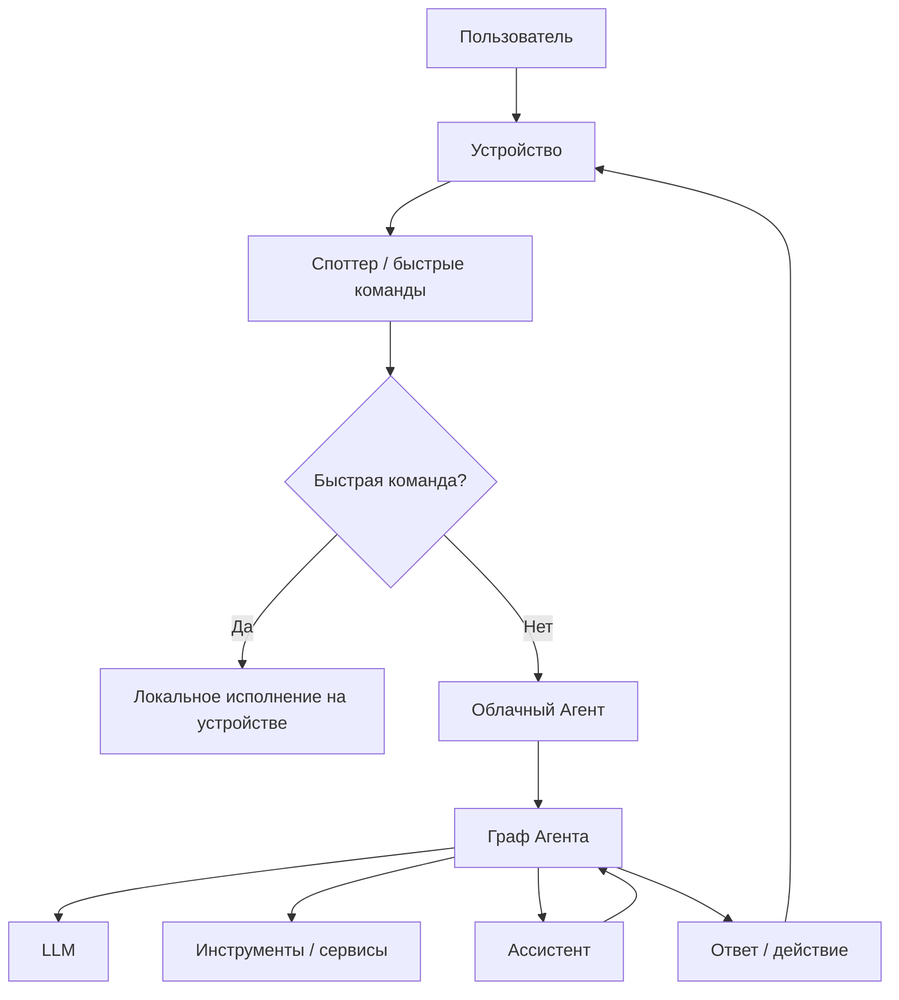

# RFC: Облачный LLM-Агент для устройств SberDevices

## Meta

| Поле | Значение |
| --- | --- |
| Автор | Думчев Артур |
| Заказчик | TBD |
| Статус | draft |
| Создан | 03.06.2026 |
| Тикет | TBD |

## Краткое содержание

Нужен агентский опыт на устройствах.

Опыт можно обеспечить тремя путями:

- локальный агент на устройствах, который сам ходит к LLM напрямую;
- доработать имеющегося ассистента (Салют, NLP);
- новый агент в облаке.

В этом RFC предлагается принять решение о том, как в SberDevices будет организовано добавление Агента (harness вроде OpenClaw, Claude Cowork).

## Мотивация

Хотим повысить полезность девайсов, предоставив полноценный функционал агента пользователям.

Функционал описан в документе `SD. Требования к платформе ИИ-помощника v3.docx`.

## Предлагаемое решение

Споттер распознаёт быстрые команды, и они исполняются локально. Этим достигается скорость для простых команд.

Основные команды идут в новый сервис — облачный Агент. Агент запускает свой [граф][1]. Какие-то задачи может делегировать другим сервисам, в том числе Ассистенту.

## Целевой flow

## Альтернативы

Всё как есть сейчас. Ассистент дорабатывается до полноценного агента.

Локальный агент.

## Нефункциональные требования

Известное входное ограничение: 4 миллиона устройств.

Расчёты ниже являются грубыми предположениями (TODO: уточнить цифры) 

| Аспект                                      | Предположение / требование                                                               | Оценка                                   |
| ---                                         | ---                                                                                      | ---                                      |
| Масштаб устройств                           | Потенциальная база устройств                                                             | 4 млн устройств                          |
| Активность                                  | Доля устройств, активных в агентском сценарии за день                                    | 15%                                      |
| Частота использования                       | Агентских запросов на активное устройство в день                                         | 3 запроса                                |
| Пользовательские агентские запросы в день   | `4 000 000 * 15% * 3`                                                                    | около 1.8 млн запросов в день            |
| Средний RPS пользовательских запросов       | `1 800 000 / 86 400`                                                                     | около 21 RPS                             |
| Пиковый RPS пользовательских запросов       | Коэффициент пика 10x к среднему                                                          | около 210 RPS                            |
| Model calls в день                          | В среднем 1.5 обращения к модели на пользовательский агентский запрос                    | около 2.7 млн model calls в день         |
| Средний RPS к модели                        | `2 700 000 / 86 400`                                                                     | около 31 model calls/s                   |
| Пиковый RPS к модели                        | Коэффициент пика 10x к среднему                                                          | около 310 model calls/s                  |
| Токены на model call                        | Средний суммарный prompt + completion                                                    | около 3 тыс. токенов                     |
| Токены на пользовательский агентский запрос | `1.5 * 3 000`                                                                            | около 4.5 тыс. токенов                   |
| Токены в день                               | `1 800 000 * 4 500`                                                                      | около 8.1 млрд токенов в день            |
| Хранение на пользователя                    | Агент хранит текст, ответы, tool/function calling trace и метаданные, но не хранит аудио | 20-80 МБ на активного пользователя в год |

Минимальные требования, которые следуют из этих оценок:

- облачный Агент должен горизонтально масштабироваться под пиковую нагрузку не ниже 210 RPS по пользовательским агентским запросам и около 310 RPS к LLM;
- TODO: сервис должен отдельно учитывать пользовательские запросы, model calls, токены и ошибки делегирования в другие сервисы;
- TODO: retention policy для истории, trace и метаданных нужно зафиксировать отдельно.

## Открытые вопросы

- Предлагаемое решение не отвечает на вопрос, где происходит распознавание речи. Если это делает Ассистент, то он может распознаваемую речь классифицировать и либо решать задачу сам, либо переводить в облачного Агента.
- Если Ассистент будет вызывать Агента, то последний должен далее общаться (цикл function calling) напрямую с устройством или через Ассистента?
- Как Ассистент и Агент понимают контекст общения с клиентом. Представим, что Ассистент распознал команду и понял, что может решить задачу без Агента. В этом случае всё равно надо уведомить Агента о том, что произошло, чтобы Агент понимал контекст для дальнейших команд.
- Альтернативное решение предполагает интеграцию большого агентского функционала (харнесс) в Ассистента. Не имеет ли смысл это сразу делать отдельным независимым сервисом (предлагаемое решение)?
- Требуется подтвердить расчетные предположения для нефункциональных требований: активность устройств, количество агентских запросов в день, среднее число model calls, среднее число токенов и объем хранимых данных на пользователя.

## Ссылки

[1]: https://github.com/D00mch/souz#graphbasedagent
[2]: https://habr.com/ru/companies/sberdevices/articles/936852/
